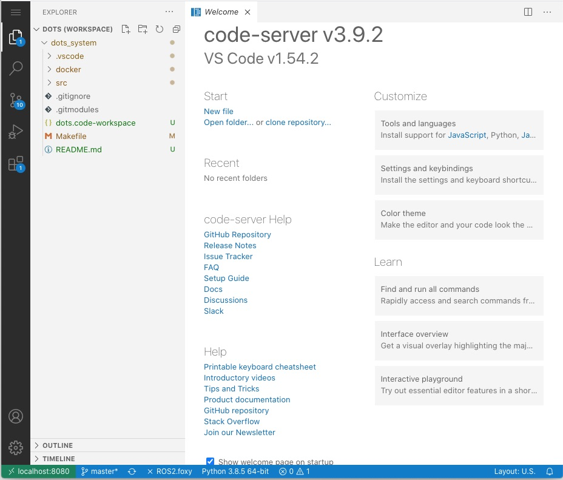
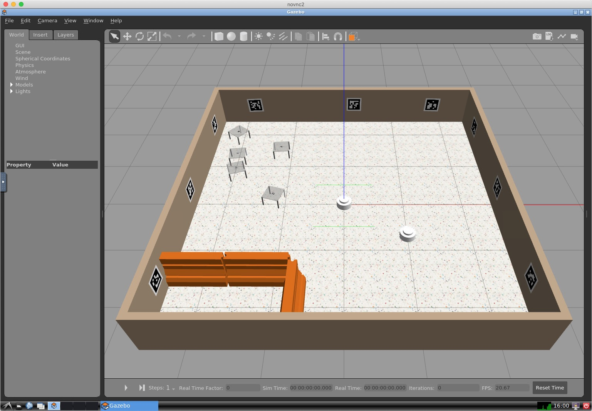
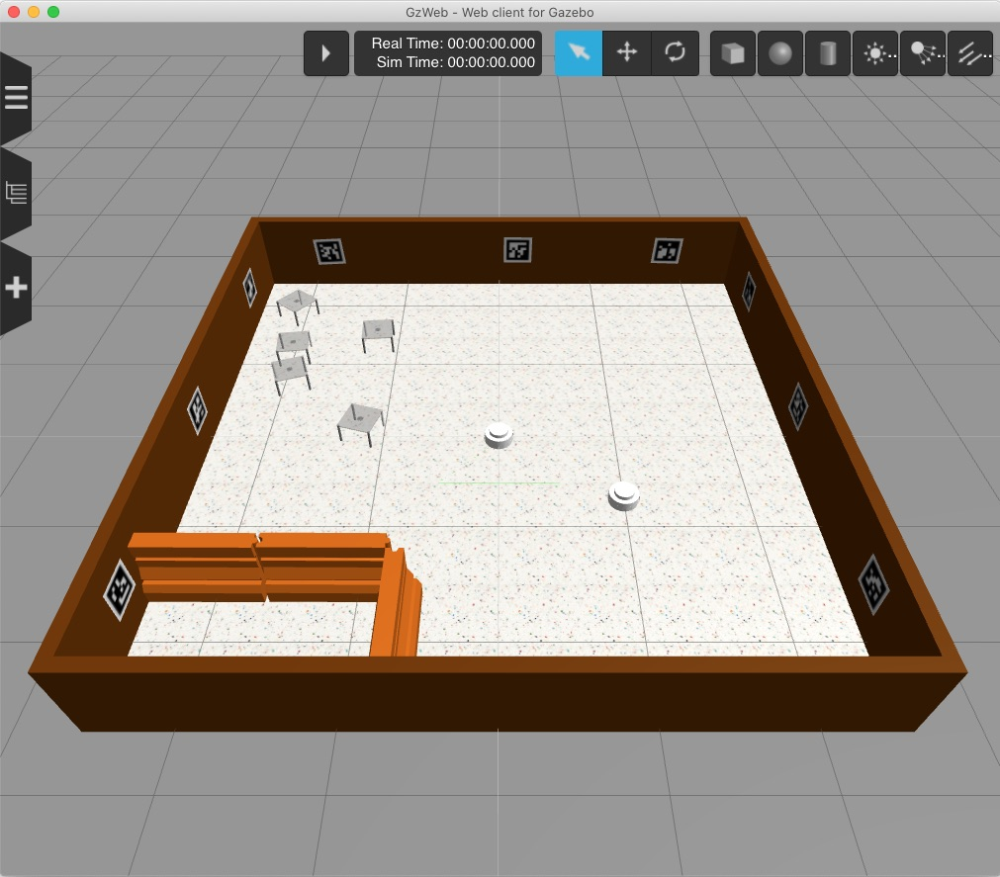

## Dots development environment

This is the Dots development environment. It is based on Docker containers, so it can run on Windows, Linux, and OSX. The directory where the environment is started is mounted within the environment so all changes are persistant.

## Prerequisites
- Working Docker installation
- (On windows) Windows System for Linux (WSL2) and Ubuntu 20.04  
    - Install WSL2 (https://docs.microsoft.com/en-us/windows/wsl/install-win10) and Ubuntu 20.04 and make sure WSL2 is enabled, not WSL1
    - Install Docker Desktop https://hub.docker.com/editions/community/docker-ce-desktop-windows/
    - Run Docker Desktop and make sure  the Ubuntu 20.04 is enabled in Settings->Resources->WSL integration
    

- git and make

## Installation
Firstly, you need to set up SSH keys on your bitbucket account if you haven't already, without this the git checkout will not work.

At your command prompt (Ubuntu 20.04 WSL2 on Windows) do the following, pressing return to all prompts. 
```
$ ssh-keygen
$ cat ~/.ssh/id_rsa.pub
ssh-rsa AAAAB3NzaC1yc2EAAAADAQABAAABgQC90jZf+uTA5MwHzEESZ+aAEqUB8yGOgQX/NM7fgn+difjKspAGn2Zt/rf4QRachx3yfBAkwZpaBtqiav/sthZiXyO0YZk1w8DkQNwEr4J4QxRnmOPHuqAQ2y5b4IzP1ob9KL9XXDGQxEh804NI7MRHLgUgDQkYz2Z+2wG6ZCB6Ao7tHXRdcY39vtUAQhfi7WCaYlDtZVw5r/6XBFH+tqmnwgYh4T9ULi3cTzLvBj7G9/UTBt4LC0bZenbSR6jy2gX6Fg+KzeDHeh0bu1ZhWf1mxiHw7OACcagQ92xhd+kBdzHrLsVgdCHDdVwMFmemlcs17D/1uc70KnrJY3qoiNhqGI799n7vUGxVydFoGjuw76Om/3cIKYMVvy+QhzT0zftTb3lk0XnmC6TYz+Haaj4Aomy2+E4J6xsE2vZsd9xqaXr3TDsjRMt/qppeHwxUc8O86sgGQqOKLtOlSCPnQkTbSziruF4NP4RJokAEJhZnIexB0HwlXRfY5z/fePmcK2U= simonj@Simons-iMac-Pro.local
```
This gives a long multiline output, example from mine shown. Copy the whole thing, starting from ```ssh-rsa```, then sign in to your bitbucket account and go to personal settings (icon at bottom left), then SSH keys, then do Add key. Give the key a name then paste the key into the box.

To download and start the environment, go to the the directory you want to keep your work, and do:
```
git clone --recursive git@bitbucket.org:hauertlab/dots_system.git
```

To build the system, do:
```
cd dots_system
make
```
This will build the docker images. The build process may take some time the first time it is done. On a fast machine with SSD and lots of memory it took about 5 minutes. On  a mediocre laptop running Windows it took about 30 minutes.

The system is started using docker-compose. Do:
```
make run
```
to start the docker environment up.

The environment presents two interfaces, both web-based. The [VSCode interface](http://localhost:8080/?workspace=/home/dots/dots_system/dots.code-workspace) is a web version of the VSCode editor. This is where you will do most coding. Click the link and you should see something like:


The [Linux desktop](http://localhost:8081/) is a web-based VNC view into a standard Linux desktop. Graphical applications such as Gazebo and Rviz will appear here. The size of the desktop is based on the size of the browser window when you open the link - make a separate browser window the size you want before opening the link.

To make sure everything is working, open a terminal in the vscode window by going Menu (top left)->Terminal->New terminal. This places you in a ROS2 workspace with the various packages for the simulator and example controller below the ```src``` directory. The simplified package structure is:
```
src
└── dots_gazebo
    ├── dots_example_controller     Example python controller performing random walk
    ├── dots_sim                    Gazebo simulator
    ├── dots_sim_support            Support files for the simulator
    └── gazebo_plugins              Simulator plugins for lifting mechanism, the coloured leds and motor drive
```
To build the packages, do:
```
colcon build --symlink-install
source install/setup.bash
```
This will traverse the packages in the ```src``` directory, compile C++ code, then install C++ and Python executables and support files. These are placed in the ```install``` directory. The ```source``` command makes the just installed packages visible to the ROS system. To run an example, do:
```
ros2 launch dots_sim run_2_explore.launch.py
```
This will start the Gazebo simulator GUI in the Linux desktop, then spawn two robots at different locations within the simulated world. It should look like this:



The simulator starts up paused, press play to start it running. The two robots should move in random curved trajectories, changing direction when they encounter an obstacle.

## GZWeb (experimental)
There is experimental support for [GZWeb](http://gazebosim.org/gzweb.html). This is a WebGL based browser front-end to Gazebo that is much more performant than the VNC-based GUI interface, but it is less mature. To try it out, add ```use_gzweb:=true``` to any launch command that would normally start the standard front-end. Connect [using this link](http://localhost:8085/).

For example, run the explore example like:
```
ros2 launch dots_sim run_2_explore.launch.py use_gzweb:=true
```
It should look like this:



## Developing
The general development flow is to make changes to your code, do ```colcon build --symlink-install```, then try out your changes. Its only necessary to do ```source install/setup.bash``` in a new terminal or after building for the first time. If you make changes to Python code, it is not usually necessary to do ```colcon build``` since symbolic links are installed for interpreted code, but sometimes this doesn't seem to work.

It is possible to start various parts separately, you might often want to e.g. have the simulator running while manually starting robots.
Some possible examples, launch with the Rviz2 app to visualise robot sense data:
```
ros2 launch dots_sim run_2_explore.launch.py rviz:=true
```
Just launch gazebo:
```
ros2 launch dots_sim gazebo.launch.py
```
Launch a single robot without a controller at a location within the arena (requires Gazebo to be running, will wait for it to be started)
```
ros2 launch dots_example_controller basic.launch.py robot_name:=r1 robot_pose:=-0.2,0.3,1.57
```
In another terminal, send a velocity command to the robot launched in the previous step:
```
ros2 topic pub /r1/cmd_vel geometry_msgs/msg/Twist "{linear: {x: 1.0, y: 0.0, z: 0.0}, angular: {x: 0.0, y: 0.0, z: 2.0}}"
```

## Interface links
|Link|Interface|
|-|-|
|http://localhost:8080/?workspace=/home/dots/dots_system/dots.code-workspace|VScode editor and terminal, in the Dots system workspace|
|http://localhost:8081/|Web VNC to Linux desktop, for conventional Gazebo front-end and other graphical linux applications|
|http://localhost:8085/|GZWeb browser front-end for Gazebo|


## Example controller
The example controller source code is in ```src/dots_gazebo/dots_example_controller/dots_example_controller/explore.py```.

## Issues
Sometimes the linux desktop does not correctly size to the window size. Sometimes reloading the page in the browser fixes this. If not, the only other fix so far is to ctrl-c the docker session and restart with `make run`.


Sometimes the Gazebo simulator doesn't corectly stop when  ctrl-c'd. A new simulation won't start because another copy is already running, there will be an error message like `EXCEPTION: Unable to start server[bind: Address already in use]. There is probably another Gazebo process running`. Fix, do `killall gzserver gzclient` before starting new simulation.


## Setting goal pose for navigator
```
ros2 topic pub -1 /robot_deadbeef/goal_pose geometry_msgs/PoseStamped "{header: {stamp: {sec: 0}, frame_id: 'odom'}, pose: {position: {x: 1.0, y: 0.0, z: 0.0}, orientation: {w: 1.0}}}"
```


## Updating submodules
To get changes, esp if after changed branch:
```
git submodule update
```

### Nav2
```
# structure
├── dots_system
│   ├── docker
│   │   └── scripts
│   ├── images
│   └── src
│       ├── dots_gazebo
│       │   ├── dots_example_controller
│       │   ├── dots_sim
│       │   ├── dots_sim_support
│       │   └── gazebo_plugins
│       ├── dots_nav
│       │   ├── dots_exp_bringup
│       │   ├── dots_experiments
│       │   └── dots_omni_controller
│       └── dots_support
│           └── dots_tf_tools
├── nav2_ws
│   └── src
│       └── navigation2
│           ├── doc
│           ├── nav2_amcl
│           ├── nav2_behavior_tree
│           ├── nav2_bringup
│           ├── nav2_bt_navigator
│           ├── nav2_common
│           ├── nav2_controller
│           ├── nav2_core
│           ├── nav2_costmap_2d
│           ├── nav2_dwb_controller
│           ├── nav2_lifecycle_manager
│           ├── nav2_map_server
│           ├── nav2_msgs
│           ├── nav2_navfn_planner
│           ├── nav2_planner
│           ├── nav2_recoveries
│           ├── nav2_regulated_pure_pursuit_controller
│           ├── nav2_rviz_plugins
│           ├── nav2_smac_planner
│           ├── nav2_system_tests
│           ├── nav2_util
│           ├── nav2_voxel_grid
│           ├── nav2_waypoint_follower
│           ├── navigation2
│           └── tools
└── nav2_ws_arm
    └── src -> ../nav2_ws/src


cd dots_project
mkdir -p nav2_ws/src
cd nav2_ws/src
git clone https://simonj23@bitbucket.org/simonj23/navigation2.git --branch foxy-devel


cd dots_project/nav2_ws_arm
rosdep update
rosdep install -y -r -q --from-paths src --ignore-src --rosdistro foxy
```